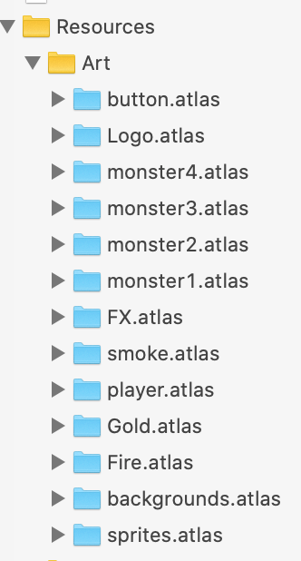
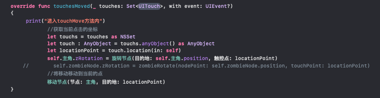

# 本人承诺
**该项目除了图片素材png是素材网站上下载，背景音乐素材mav和mps是素材网站爬取，以及为了实现数据本地保存而导入了SKTUtils框架之外，该项目的GameScene.Swift 和 soundManager.Swift的代码都是都是独立完成，（中文版）里面有非常详细的注释，此外本身变量就是注释，因此代码逻辑几乎看一遍就懂。逻辑非常容易看懂。此外，为了实现动画粒子的效果，在网上查找了相关sks的简介以及获取了相关素材sks替换成自己准备的图片素材制作了自己的动画粒子效果。**

# 先展示一些静态图片的效果(实际游戏都是动态和带音效的）
开始游戏界面

发生碰撞后

游戏结束

## 项目结构
项目文件主要分成四部分
1. 人物节点相互碰撞所产生的动画效果的**sks粒子文件**
2. 管理声音播放的Sounds文件夹的**mav**和 **mps音乐素材**。
3. 管理任务节点图片渲染和gif的**atlas文件**
4. 执行主要逻辑功能的**Swift文件**

## 项目设计思路（详细)
首先介绍游戏scene的产生。我们在GameViewController.swift文件中重载了**viewDidLoad（）**函数，使得***原来默认是通过sks生成场景***的修改成***通过GameScene来生成我们的场景***。在这里我运用了一个小的设计技巧，就是在创建scene的时候先获取设备的***长***和***宽***，这样我scene里面的所有节点的大小都可以通过这个长和宽的比例来设置，这样在各类设备上都能良好的填充显示。

所以你观察源代码会发现，里面的所有节点的CGSize都是通过根据**长**和**宽**的比例进行设置大小的。

设计思路：主要介绍系统自带的**didMove函数**，**touchesBegan函数**，**update函数**，**touchesMove函数**以及我如何借助这些函数来实现对节点的触控，以及每一帧画面的更新。
1. 这里首先介绍**didMove函数**，因为**didMove函数**是在scene被创建出来的时候首先被调用的，所以这个函数非常适合用来创建游戏的初始画面（**主菜单**）然后把游戏状态切换到主菜单状态，等来主菜单下用户的输入来改变游戏状态。

加载完主菜单之后，实际上我们看到的就是游戏开始的界面，这个时候需要接受用户的输入来改变游戏状态，对了，这里的游戏状态我们分为**主菜单**，**游戏开始**，**游戏结束**，以及**显示分数**这四种状态。

 
2. 接着我们的接受的是最主要的一个函数就是**touchesBegan函数**，因为通过这个函数我们接受用户的**触控点**，***从而获取触控坐标***，这里需要指出，由于SpriteKit框架里暂时没发现Button的按钮，几乎一切都是SpriteNode，***所以这里的开始游戏按钮也是一个SpriteNode***，我们只能通过计算坐标来锁定开始按钮button的坐标区域，从而判断用户是否点击了这个开始按钮

一旦用户点击了这个范围就正式切换到游戏状态，从而**remove**掉主菜单的原先节点，**addChild**那些游戏场景的节点，并开始游戏！

在这个函数里我们显示调用run动作让每一个name为主菜单的节点（我们在add主菜单节点的时候为每个节点都命名了），从而去除主菜单的场景，然后设置相关游戏的节点，并且重复添加金币和障碍使得他们从屏幕外不断向左移动。
3. 接着我们介绍的是**touchesMove函数**，顾名思义，它和**touchesBegan**效果差不多，只不过是**获取手指滑动的坐标**，因此我们利用这两个函数来让主角可以**旋转移动**，躲避障碍并获取金币！！
 
 这里我们额外实现了**移动节点()**和**旋转节点（）**两个函数，其实原理都非常简单，移动节点就是直接给目标节点一个Action，并且令这个节点**run**这个Action来实现**MoveTo**动作，而旋转节点（）同样很简单，就是根据触控获得的坐标，根据节点自身的坐标，计算出角度θ，然后调用旋转节点函数，将计算出的角度结果赋值给这个节点的**zRotation**属性即可。这样节点就会跟着我们玩家的手指的位置跑了！
 
4. 接着介绍同样非常非常重要的函数**didBegin**函数，这个函数式用来检测碰撞检测的。我们这里的主要节点都设置了物理类，就是说每一个节点归属一个物理类，发生碰撞的时候根据这个物理类属性判断是哪两个物体发生了碰撞。其中设置物理类归属的方法是***.categoryBitMask***  ， 设置物体碰撞检测的物理类的方法是***.contactBitMaek***,因此我们为主角设置的碰撞检测是其他障碍和金币类，而障碍和金币类设置他们只能和主角发生碰撞，这样的话只要发生碰撞，就一定是主角和某一个节点发生了碰撞，所以很容易在didBegan判断出主角和谁发生了碰撞，然后根据不同碰撞节点的属性做相应的操作即可。
 
 这里我们提一下物理类的划分
 
 非常容易看出，游戏角色类的值最小，所以在发生碰撞时非常容易判断谁是主角了（**categoryBitMask**最小的那个就是）
1. 其中update函数是系统自带的函数，他会在每一帧画面刷新时被调用。所以我利用update的这一点性质实现画面的每一帧刷新和移动。而实现画面的移动非常简单，就是每一帧画面的坐标**position.x-1**,因此，在60帧的情况下，人眼就能看到图片是在缓慢地向左移动，因为**update**一直在更新图片的**position.x**,从而产生图片移动的效果。这里我制作的背景图片是一片长图被切成**6块**，放到数组内保存，然后，屏幕分成三块显示（左中右），另外还有一片备用在屏幕外侧（***通过计算发现三片不够***），从而在update函数中不断地令这些图片的x坐标-1实现背景移动的效果。

这里我们借助**简单的数学运算**和**数组的循环**即可实现图片在屏幕的往返循环！
6. 我们在屏幕外也生成了许多妖怪和金币等物体，他们都是在生成的时候**被放置在屏幕外**，然后同样**借助update函数的刷新**实现这些物体的**向左移动**。所以在update函数中扶着执行各类节点的移动操作。

### 下面介绍音效播放
这里实现音效管理的是**soundManager.swift**函数，我们需要引入多媒体框架（**import AVFoundation**) 然后直接获取**AVAudioPlayer（）** 即可实现对我们导入的音效素材进行管理和播放了。

因为我们在游戏场景发生碰撞的时候直接根据碰撞类型的不同，来调用sound里面的相关音效即可实现简单的音效控制。比如进入游戏时播放游戏BGM。

### 下面介绍动画粒子效果
这里即是指的是sks文件。具体介绍网上很详细，这里只是诉说如何运用sks。用利用sks文件，我们得设置sks文件的**texture**，就是让喷射出来的效果有具体的**图片素材**。

我们只需要对每一种sks设置不同的texture就可以把sks运用到不同的碰撞中，根据不同的碰撞调用不同的喷射粒子的效果。
下面是**addChild相应的粒子效果**的源代码，这里运用的是**SKEmitterNode**节点，通过设置这个节点的相关位置属性和Action动作，然后根据对应的sks进行粒子展示，而我=我们只需要简单地设置一下**SKAction**的等待时间和持续时间节课，把它**addCHild**到主屏幕上即可展示出粒子喷射的效果了。

因此在碰撞检测中根据不同类型的碰撞检测实现触发不同类型的sks粒子散射效果。比如触碰到毒烟时激发毒烟的粒子效果

 

